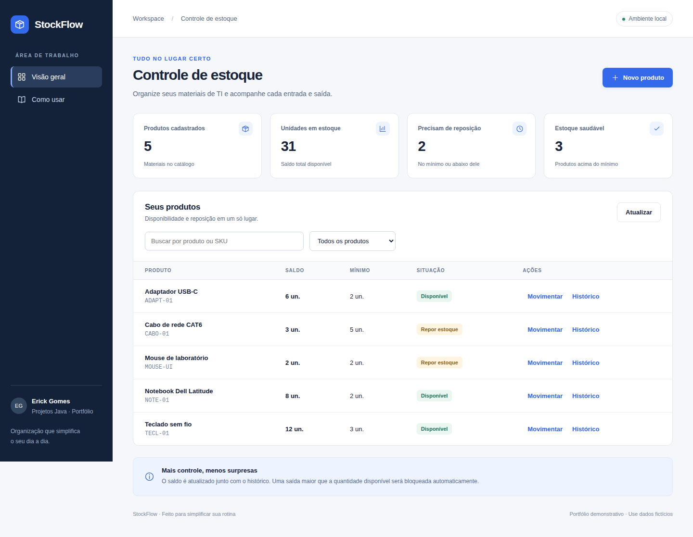
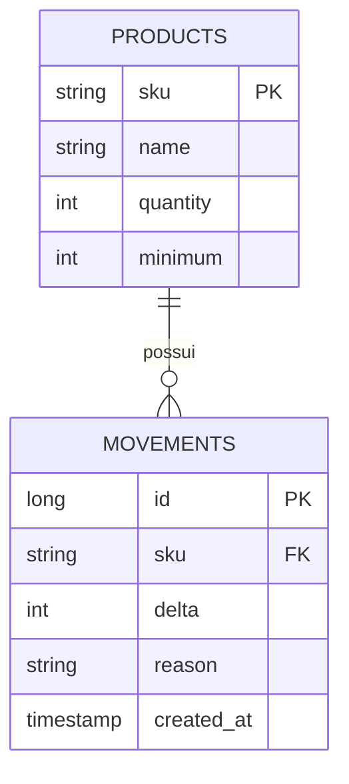

# StockFlow · Java com interface web

## Interface web · versão 1.1.0



Execute `java -jar target/app.jar` e abra **http://localhost:8080**. Use os formulários e botões para cadastrar e acompanhar seus dados. [Guia da interface e atualização](docs/INTERFACE.md).

O front-end responsivo é embarcado no JAR, sem instalação de Node para o usuário. A automação em **Actions** valida Java e fluxos de navegador e entrega um ZIP Windows com iniciador e checksum. Publicações versionadas ficam disponíveis pelo workflow **Publicar versão**.


Controle de estoque de materiais de TI pelo navegador ou terminal. Demonstra fundamentos de Java e integridade de dados: cadastrar produtos, registrar entradas e saídas, consultar histórico e identificar reposição.

**Java 17 · POO · Collections · JDBC · SQL · H2 · JUnit**

Projeto didático de portfólio de [Erick Gomes](https://github.com/Gmerick), criado com apoio de IA e dados fictícios. Inspirado em rotinas de infraestrutura e suporte, sem vínculo com uma operação empresarial real.

## O que resolve

Uma equipe de TI precisa saber quantos mouses, teclados e adaptadores possui e por que o saldo mudou. Cada movimentação atualiza o saldo e grava seu motivo na mesma transação. Saídas não podem gerar estoque negativo.

## Executar em 2 minutos

Pré-requisitos: **JDK 17+**, **Maven 3.6.3+** e Git. Confira `java -version`, `javac -version` e `mvn -version`. Na primeira compilação, Maven precisa de internet.

```bash
git clone https://github.com/Gmerick/java-it-inventory.git
cd java-it-inventory
mvn clean verify
java -jar target/app.jar demo
```

O `demo` usa banco em memória, pode ser repetido e não altera seu estoque persistente. Resultado principal: um produto, duas unidades, dois movimentos e um bloqueio de saída insuficiente.

## Use seu próprio estoque de laboratório

Os comandos abaixo funcionam no PowerShell, cmd e Bash. As aspas mantêm nomes com espaços em um único argumento.

```bash
java -jar target/app.jar add MOUSE-01 "Mouse USB" 2
java -jar target/app.jar in MOUSE-01 5 "Compra ficticia"
java -jar target/app.jar out MOUSE-01 3 "Entrega ficticia"
java -jar target/app.jar list
java -jar target/app.jar history MOUSE-01
java -jar target/app.jar summary
java -jar target/app.jar out MOUSE-01 10 "Teste saldo insuficiente"
```

O último comando deve falhar com código 2. Não repita `add` para o mesmo SKU: duplicidade é rejeitada com código 3. `help` lista os comandos. As demais falhas de banco também usam código 3.

O banco fica em `data/inventory.mv.db`, relativo ao diretório de execução. Rode todos os comandos na mesma pasta. Configure `INVENTORY_DB_URL` para usar outro banco H2; não execute duas CLIs ao mesmo tempo sobre o mesmo arquivo. Para reiniciar a demonstração persistente, pare o programa e renomeie a pasta `data` como backup.

## Regras e exemplos

| Regra | Exemplo |
| --- | --- |
| SKU único, normalizado para maiúsculas | `mouse-01` e `MOUSE-01` identificam o mesmo produto |
| Entrada e saída exigem quantidade positiva | `out MOUSE-01 -2` é inválido |
| Saldo nunca negativo | retirar 10 de um saldo 2 é rejeitado |
| Saldo e histórico são atômicos | falha na auditoria desfaz o saldo |
| Reposição quando saldo ≤ mínimo | saldo 2, mínimo 2: precisa repor |
| Limite de saldo inteiro | overflow é rejeitado |

## Arquitetura

- `InventoryApp`: leitura de argumentos e mensagens de terminal.
- `InventoryService`: validação, normalização e resumo com List, Map e Streams.
- `InventoryRepository`: PreparedStatement, transações e consultas SQL.
- `Product` / `Movement`: snapshots imutáveis em records.



## Testar e estudar

```bash
mvn clean verify
```

Os testes exercitam persistência, normalização, duplicidade, entradas inválidas, rollback, concorrência e overflow. Consulte [validação](docs/VALIDACAO.md).

- [Roteiro de apresentação e perguntas](docs/APRESENTACAO.md)
- [Guia de estudo](docs/ESTUDO.md)
- [Decisões técnicas](docs/DECISOES.md)
- [Consultas SQL](examples/queries.sql)

## Limitações

Aplicação de terminal, sem interface web ou integração AWS. Não gerencia patrimônio individual, localização física ou usuários. Não possui autenticação; use apenas dados fictícios. H2 em arquivo atende ao laboratório, sem alegação de escala empresarial.
